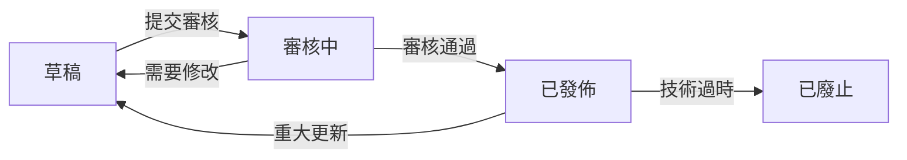

# 文件版本控制與更新流程指南

## 文件資訊
- **文件名稱**：文件版本控制與更新流程指南
- **文件編號**：PROJ-2025-004
- **版本號**：v1.0
- **制定日期**：2025-03-22
- **制定人**：系統架構師
- **文件狀態**：已發佈
- **更新頻率**：按需
- **保密等級**：內部

## 版本歷史
| 版本號 | 修訂日期 | 修訂人 | 修訂內容 |
|--------|----------|--------|----------|
| v1.0   | 2025-03-22 | 系統架構師 | 初始版本 |

---

## 1. 目的與範圍

### 1.1 文件目的
本指南旨在建立統一的技術文件版本控制與更新流程，確保文件的可追溯性、一致性和可靠性，支持團隊協作和知識管理。

### 1.2 適用範圍
適用於代理IP池收集器整合專案中的所有技術文件，包括但不限於：
- 架構設計文檔
- 技術規範文檔
- 開發指南
- 運維手冊
- 項目管理文檔

### 1.3 名詞定義
| 名詞 | 定義 |
|------|------|
| 主版本號 | 重大架構變更或功能重構時更新的版本號 |
| 次版本號 | 新功能添加或較大改進時更新的版本號 |
| 修訂號 | 錯誤修復或小改動時更新的版本號 |
| 文件狀態 | 文件當前的生命週期狀態 |

---

## 2. 版本命名規則

### 2.1 語義化版本控制
採用 `主版本號.次版本號.修訂號` 的格式（如：v2.1.3）

#### 版本號更新規則
```
主版本號（X.0.0）變更條件：
- 文件架構重大重構
- 核心概念定義變更
- 技術方案根本性改變
- 影響多個系統組件的變更

次版本號（0.X.0）變更條件：
- 新增重要章節或功能模組
- 技術方案優化改進
- 增加新的配置選項
- 擴展使用場景說明

修訂號（0.0.X）變更條件：
- 錯別字修正
- 格式調整
- 連結更新
- 小幅度內容優化
```

### 2.2 文件命名規範
```
格式：{日期}_{文件主題}_{版本號}.md
示例：
✅ 20250322_技術文件標準化規範_v1.0.md
✅ 20250322_監控指標定義_v2.1.3.md
✅ 20250322_項目改善計劃_v1.2.0.md

錯誤示例：
❌ 技術文件標準化規範.md（缺少日期）
❌ 2025-03-22-技術文件標準化規範.md（分隔符錯誤）
❌ 技術文件標準化規範_v1.md（版本號不完整）
```

### 2.3 文件編號體系
```
格式：PROJ-{年份}-{序號}

分類編號規則：
- PROJ-2025-001 ~ 099：架構設計類文檔
- PROJ-2025-101 ~ 199：技術規範類文檔
- PROJ-2025-201 ~ 299：開發指南類文檔
- PROJ-2025-301 ~ 399：運維文檔類
- PROJ-2025-401 ~ 499：項目管理類文檔
- PROJ-2025-501 ~ 599：技術組件文檔

示例：
- PROJ-2025-001：後端架構規格書
- PROJ-2025-102：技術文件標準化規範
- PROJ-2025-401：項目進度報告書
```

---

## 3. 文件狀態管理

### 3.1 文件生命週期狀態
```
草稿 (Draft) → 審核中 (Review) → 已發佈 (Published) → 已廢止 (Deprecated)
```

#### 狀態定義與規則
| 狀態 | 定義 | 使用場景 | 權限要求 |
|------|------|----------|----------|
| **草稿** | 正在編寫或修改中的文件 | 初始創建、重大修改 | 撰寫人可編輯 |
| **審核中** | 提交審核等待批准的文檔 | 完成初稿、準備發佈 | 審核人可查看 |
| **已發佈** | 正式生效的標準文檔 | 審核通過、正式使用 | 僅管理員可修改 |
| **已廢止** | 不再使用的過期文檔 | 技術過時、被替代 | 僅管理員可更新 |

### 3.2 狀態轉換流程


---

## 4. 更新流程規範

### 4.1 更新申請流程

#### 步驟1：變更申請
```markdown
## 文件變更申請表

### 基本信息
- **申請人**：
- **申請日期**：
- **文件名稱**：
- **文件編號**：
- **當前版本**：
- **建議新版本**：

### 變更類型
- [ ] 錯誤修正（修訂號+1）
- [ ] 內容補充（次版本號+1）
- [ ] 重大重構（主版本號+1）
- [ ] 緊急更新（說明原因）

### 變更原因
（詳細說明變更的必要性和具體內容）

### 影響評估
- **影響的文件**：
- **影響的系統組件**：
- **影響的人員**：

### 附件
- [ ] 變更前後對比
- [ ] 技術評估報告
- [ ] 測試驗證結果
```

#### 步驟2：影響評估
```python
# 影響評估檢查表
class ChangeImpactAssessment:
    def assess_document_change(self, change_request):
        impact_score = 0
        
        # 技術影響評估
        if change_request.affects_architecture:
            impact_score += 3
        
        # 人員影響評估
        if change_request.affects_multiple_teams:
            impact_score += 2
        
        # 系統影響評估
        if change_request.affects_production:
            impact_score += 4
        
        # 時間影響評估
        if change_request.is_urgent:
            impact_score += 2
        
        return self.classify_impact(impact_score)
    
    def classify_impact(self, score):
        if score >= 8:
            return "高影響 - 需要架構師審批"
        elif score >= 5:
            return "中影響 - 需要技術負責人審批"
        else:
            return "低影響 - 文檔管理員審批"
```

#### 步驟3：版本更新
```python
# 版本號自動更新邏輯
def update_version(current_version, change_type):
    """
    根據變更類型自動更新版本號
    
    Args:
        current_version: 當前版本號 (如: "1.2.3")
        change_type: 變更類型 ("major", "minor", "patch")
    
    Returns:
        str: 新的版本號
    """
    major, minor, patch = map(int, current_version.split('.'))
    
    if change_type == "major":
        major += 1
        minor = 0
        patch = 0
    elif change_type == "minor":
        minor += 1
        patch = 0
    elif change_type == "patch":
        patch += 1
    
    return f"{major}.{minor}.{patch}"
```

### 4.2 審核批准流程

#### 審核權限矩陣
| 文件類型 | 低影響 | 中影響 | 高影響 |
|----------|--------|--------|--------|
| **技術規範** | 文檔管理員 | 技術負責人 | 架構師 |
| **架構設計** | 技術負責人 | 架構師 | CTO |
| **項目管理** | 項目經理 | 部門主管 | 高層管理 |
| **運維文檔** | 運維負責人 | 技術負責人 | 架構師 |

#### 審核檢查表
```markdown
## 文件更新審核檢查表

### 內容審核
- [ ] 技術內容準確性
- [ ] 變更必要性評估
- [ ] 影響範圍完整性
- [ ] 向後兼容性

### 格式審核
- [ ] 版本號更新正確性
- [ ] 文件命名規範性
- [ ] 版本歷史完整性
- [ ] 格式標準一致性

### 流程審核
- [ ] 變更申請表完整性
- [ ] 影響評估充分性
- [ ] 相關人員通知
- [ ] 更新時效性
```

### 4.3 發佈通知流程

#### 通知模板
```markdown
## 技術文件更新通知

### 基本信息
- **文件名稱**：{document_name}
- **文件編號**：{document_id}
- **更新版本**：{new_version}（原版本：{old_version}）
- **更新日期**：{update_date}
- **更新人**：{updater}

### 變更摘要
{change_summary}

### 主要變更內容
1. {change_item_1}
2. {change_item_2}
3. {change_item_3}

### 影響說明
- **影響範圍**：{impact_scope}
- **建議行動**：{recommended_actions}
- **注意事項**：{cautions}

### 獲取方式
- 文件位置：{document_path}
- 在線查看：{document_url}
- 下載連結：{download_link}

### 聯繫方式
如有疑問，請聯繫：{contact_person} ({contact_email})
```

---

## 5. 版本歷史管理

### 5.1 版本歷史格式
```markdown
## 版本歷史

### v2.1.3 (2025-03-22)
#### 新增
- 添加API性能監控指標說明
- 新增錯誤處理機制章節

#### 修改
- 更新系統架構圖，優化視覺呈現
- 優化資料庫設計文檔，添加索引建議

#### 修復
- 修復配置參數描述錯誤
- 更正API端點路徑錯誤

### v2.1.2 (2025-03-20)
#### 修復
- 修正代理驗證超時時間單位錯誤
- 更新已失效的外部連結

### v2.1.1 (2025-03-18)
#### 修改
- 優化章節結構，提高可讀性
- 補充配置示例和代碼片段
```

### 5.2 變更分類標準

#### 新增（Added）
- 新增章節或功能模組
- 添加新的配置選項
- 增加使用示例和代碼片段

#### 修改（Modified）
- 優化現有內容描述
- 更新技術方案說明
- 改進架構設計圖表

#### 修復（Fixed）
- 修正錯別字和語法錯誤
- 更正技術參數錯誤
- 修復格式和排版問題

#### 刪除（Removed）
- 移除過時的技術方案
- 刪除廢棄的配置選項
- 清理無效的連結和引用

### 5.3 變更追蹤要求
```python
# 變更追蹤模板
class ChangeTracker:
    def __init__(self):
        self.changes = []
    
    def add_change(self, change_type, description, 
                   author, date, reason):
        """添加變更記錄"""
        change = {
            'type': change_type,
            'description': description,
            'author': author,
            'date': date,
            'reason': reason,
            'impact': self.assess_impact(description)
        }
        self.changes.append(change)
    
    def generate_changelog(self, version):
        """生成版本變更日誌"""
        return {
            'version': version,
            'release_date': datetime.now(),
            'changes': self.changes,
            'summary': self.generate_summary()
        }
```

---

## 6. 工具與自動化

### 6.1 推薦工具配置

#### Git 配置（版本控制）
```bash
# .gitattributes 配置
*.md diff=markdown
*.md merge=union

# 提交消息模板
echo "docs: 更新技術文件版本至 v2.1.3

- 新增API性能監控指標
- 修復配置參數錯誤
- 優化架構圖設計

影響範圍：開發團隊、運維團隊
文件編號：PROJ-2025-102" > .gitmessage
```

#### Markdown 編輯器配置
```json
// VS Code settings.json
{
  "markdown.extension.toc.levels": "1..4",
  "markdown.extension.toc.orderedList": false,
  "markdown.extension.toc.plaintext": true,
  "markdown.extension.toc.updateOnSave": true,
  "markdownlint.config": {
    "MD003": { "style": "atx" },
    "MD007": { "indent": 4 },
    "MD013": false, // 行長度限制
    "MD024": false  // 重複標題
  }
}
```

### 6.2 自動化腳本

#### 版本號自動更新腳本
```python
#!/usr/bin/env python3
"""
技術文件版本自動更新腳本
"""

import re
import argparse
from datetime import datetime
from pathlib import Path

class DocumentVersionUpdater:
    def __init__(self, file_path):
        self.file_path = Path(file_path)
        self.content = self.file_path.read_text(encoding='utf-8')
    
    def get_current_version(self):
        """提取當前版本號"""
        version_match = re.search(r'版本號.*v(\d+\.\d+\.\d+)', self.content)
        return version_match.group(1) if version_match else "1.0.0"
    
    def update_version(self, new_version, change_type="patch"):
        """更新版本號和相關資訊"""
        # 更新版本號
        old_version = self.get_current_version()
        self.content = re.sub(
            rf'版本號.*v{re.escape(old_version)}',
            f'版本號：v{new_version}',
            self.content
        )
        
        # 更新修訂日期
        self.content = re.sub(
            r'修訂日期.*\d{4}-\d{2}-\d{2}',
            f'修訂日期：{datetime.now().strftime("%Y-%m-%d")}',
            self.content
        )
        
        return self.content
    
    def add_changelog_entry(self, version, changes):
        """添加版本歷史記錄"""
        changelog_entry = f"""
### v{version} ({datetime.now().strftime("%Y-%m-%d")})
"""
        for change_type, descriptions in changes.items():
            if descriptions:
                changelog_entry += f"#### {change_type}\n"
                for desc in descriptions:
                    changelog_entry += f"- {desc}\n"
        
        # 在版本歷史章節添加新條目
        self.content = re.sub(
            r'(## 版本歷史)',
            f'\\1\n{changelog_entry}',
            self.content
        )
        
        return self.content
    
    def save(self):
        """保存更新後的文件"""
        self.file_path.write_text(self.content, encoding='utf-8')
        print(f"✅ 文件已更新：{self.file_path}")
        print(f"📋 新版本號：v{self.get_current_version()}")

# 使用示例
if __name__ == "__main__":
    parser = argparse.ArgumentParser(description='更新技術文件版本')
    parser.add_argument('file', help='文件路徑')
    parser.add_argument('--type', choices=['major', 'minor', 'patch'], 
                       default='patch', help='變更類型')
    parser.add_argument('--changes', nargs='+', help='變更描述')
    
    args = parser.parse_args()
    
    updater = DocumentVersionUpdater(args.file)
    current_version = updater.get_current_version()
    
    # 計算新版本號
    major, minor, patch = map(int, current_version.split('.'))
    
    if args.type == 'major':
        major += 1
        minor = patch = 0
    elif args.type == 'minor':
        minor += 1
        patch = 0
    else:  # patch
        patch += 1
    
    new_version = f"{major}.{minor}.{patch}"
    
    # 更新文件
    updater.update_version(new_version, args.type)
    
    if args.changes:
        changes = {"修改": args.changes}
        updater.add_changelog_entry(new_version, changes)
    
    updater.save()
```

---

## 7. 培訓與實施

### 7.1 培訓計劃

#### 第一階段：基礎培訓（2小時）
1. **版本控制概念**（30分鐘）
   - 什麼是語義化版本控制
   - 為什麼需要版本控制
   - 版本控制的基本原則

2. **命名規範說明**（30分鐘）
   - 文件命名規則
   - 版本號命名規則
   - 文件編號體系

3. **實踐操作**（60分鐘）
   - 實際案例分析
   - 工具使用演示
   - 問題解答

#### 第二階段：進階培訓（2小時）
1. **更新流程實踐**（60分鐘）
   - 完整的更新流程演示
   - 審核流程模擬
   - 常見問題處理

2. **工具使用**（60分鐘）
   - 自動化腳本使用
   - Git整合操作
   - 批量處理技巧

### 7.2 實施時程

| 階段 | 時間 | 負責人 | 參與人員 |
|------|------|--------|----------|
| **標準發佈** | 第1天 | 架構師 | 全體技術人員 |
| **基礎培訓** | 第2-3天 | 架構師 | 技術團隊 |
| **試點實施** | 第4-7天 | 文檔管理員 | 核心開發者 |
| **全面推廣** | 第8-14天 | 技術負責人 | 全體成員 |
| **檢查改進** | 第15-21天 | 質量保證 | 審核人員 |

---

## 8. 常見問題與解答

### Q1: 如何處理緊急更新？
**A**: 建立緊急更新流程：
1. 口頭或即時通訊申請變更
2. 獲得口頭批准後立即更新
3. 24小時內補齊書面手續
4. 通知相關人員

### Q2: 版本號可以跳過嗎？
**A**: 不建議跳過版本號，但在以下情況可以：
- 發現重大錯誤需要緊急回滾
- 多個變更合併為一次發佈
- 預留版本號給未來功能

### Q3: 如何處理並發更新？
**A**: 採用樂觀鎖定策略：
1. 更新前檢查當前版本
2. 基於最新版本進行修改
3. 提交時再次確認版本
4. 如發生衝突，手動合併

### Q4: 歷史版本需要保留嗎？
**A**: 建議保留策略：
- **永久保留**：已發佈的重要版本
- **保留1年**：開發過程中的中間版本
- **保留30天**：日常的微小修訂

---

## 9. 監控與改進

### 9.1 關鍵指標（KPI）

| 指標名稱 | 目標值 | 監控頻率 | 責任人 |
|----------|--------|----------|--------|
| **版本合規率** | ≥95% | 每月 | 文檔管理員 |
| **更新及時率** | ≥90% | 每週 | 技術負責人 |
| **審核通過率** | ≥85% | 每月 | 架構師 |
| **錯誤回退率** | ≤5% | 每季度 | 質量保證 |

### 9.2 持續改進機制
1. **月度回顧**：每月檢查流程執行情況
2. **季度優化**：根據反饋優化流程
3. **年度評估**：全面評估流程有效性
4. **工具升級**：持續改進自動化工具

---

## 相關文件
- [技術文件標準化規範](20250322_技術文件標準化規範.md)
- [技術文件審查報告](20250322_技術文件審查報告.md)
- [項目文件命名規範](20250322_項目文件命名規範.md)

---

## 附錄

### A. 快速參考卡
```
版本號格式：主.次.修（如：v2.1.3）
文件命名：日期_主題_版本.md
文件編號：PROJ-2025-XXX
狀態流程：草稿→審核中→已發佈→已廢止

緊急聯繫：
- 文檔管理員：doc-admin@company.com
- 技術負責人：tech-lead@company.com
- 架構師：architect@company.com
```

### B. 工具下載連結
- [版本更新腳本](tools/version_updater.py)
- [合規檢查工具](tools/compliance_checker.py)
- [批量重命名工具](tools/batch_renamer.py)

---
**文件結束**